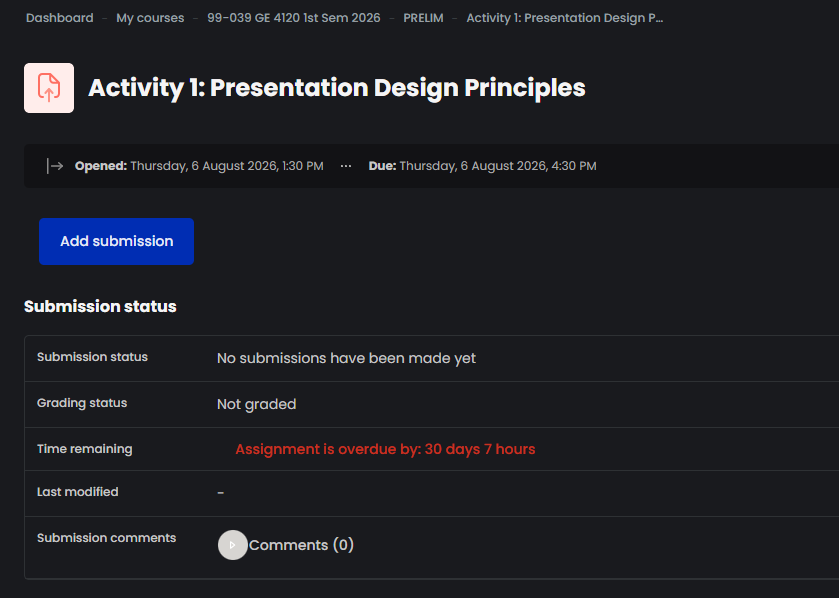
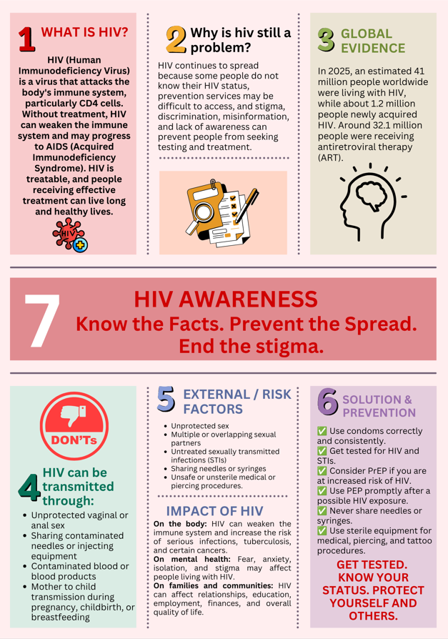

 [README](#) | [Activity 1](Activity1.md) | [Activity 2](Activity2.md) | [Activity 3](Activity3.md)

# Prelim Period — Activity Portfolio

A collection of three activities completed during the Prelim period covering core concepts in presentation design, visual identity, and infographic communication.

📁 **Project Overview**

<table>
  <tr>
    <td width="30%" align="center" valign="top">
       
      
     
        
      <strong>KIANA ANGELA E. ARPILLEDA</strong> 
      BSN 4F | CLASS OF 2026
    </td>
    <td width="70%" valign="top">
      <h3>📄 Personal Profile</h3>
      <ul>
        <li><strong>Full Name:</strong> Kiana Angela E. Arpilleda</li>
        <li><strong>Course:</strong> Bachelor of Science in Nursing (BSN)</li>
        <li><strong>Section:</strong> 4F</li>
      </ul>
      

      <h3> ✿❀ Quick Favorites</h3>
      <ul>
        <li> <strong>Favorite Food:</strong> Chicken with white sauce</li>
        <li> <strong>Favorite color:</strong> Pink</li>
        <li> <strong>Favorite Movie:</strong> <em>World War Z</em></li>
      </ul>
    </td>
  </tr>
</table>

### 🖼️ Activity 1: Presentation Design

* [View Activity 1 Details](Activity1.md)

---

### 🖼️ Activity 2: Visual Identity

* [View Activity 2 Details](Activity2.md)

---

### 🖼️ Activity 3: Infographic Communication

* [View Activity 3 Details](Activity3.md)
